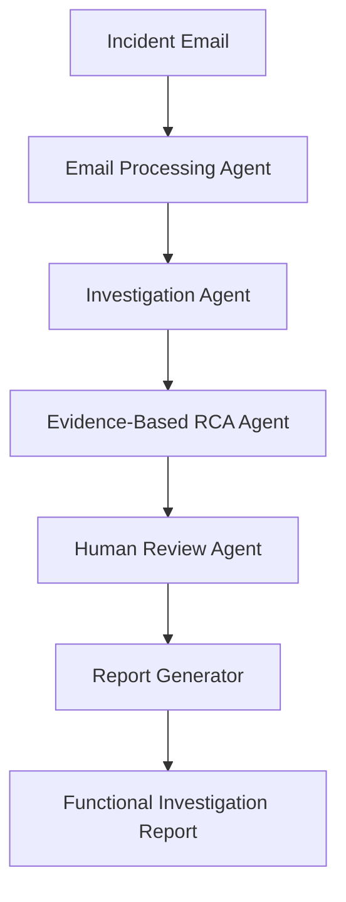

# 🌿 FutureCATLeaf

## AI-Assisted Functional Investigation System

> **Evidence First. Reason Second. Human Always.**

## Project overview

FutureCATLeaf is a multi-agent AI application built using Google ADK and Gemini that assists enterprise support teams in investigating functional IT incidents. It combines structured incident analysis, evidence collection, explainable reasoning, and human review to produce consistent and auditable investigation reports.

The project demonstrates how Generative AI can enhance enterprise incident management by combining structured incident analysis, evidence collection, explainable root cause reasoning, and human governance. Rather than replacing human expertise, FutureCATLeaf augments functional consultants by helping them investigate incidents more efficiently and consistently.

FutureCATLeaf uses mock enterprise data for demonstration purposes and requires human review before investigation results are considered final.

## Current Capabilities

**Version:** v1.0.0

A proof-of-concept multi-agent AI system demonstrating evidence-based functional incident investigation for enterprise support teams.

Implemented

- ✅ Email Processing Agent
- ✅ Investigation Agent
- ✅ Evidence-Based Root Cause Reasoning Agent
- ✅ Human Review Agent
- ✅ Functional Investigation Report Generator
- ✅ Markdown Investigation Reports
- ✅ JSON Audit Trail

Planned

- 🚧 Oracle Integration
- 🚧 ServiceNow Integration
- 🚧 Semantic Search (RAG)
- 🚧 Web Dashboard

## Business Problem

Enterprise support teams spend significant time:

- Reading incident emails
- Understanding business processes
- Searching documentation
- Reviewing logs
- Checking master data
- Comparing previous incidents
- Preparing Root Cause Analysis (RCA) reports

This investigation process is often manual, time-consuming, and dependent on individual experience.

FutureCATLeaf demonstrates how AI can assist functional consultants by automating evidence collection and producing explainable investigation reports while keeping humans responsible for final decisions.

## Solution Overview

FutureCATLeaf follows an evidence-driven investigation workflow.

1. Parse the incident email.
2. Extract structured incident details.
3. Search enterprise knowledge sources.
4. Collect supporting evidence.
5. Evaluate multiple hypotheses.
6. Recommend the most probable cause.
7. Present findings for human review.
8. Generate a professional Functional Investigation Report.

## Key Features

- Structured incident extraction
- Functional evidence collection
- Business rule evaluation
- Multiple root-cause hypotheses
- Explainable AI reasoning
- Human-in-the-loop review
- Functional Investigation Report generation
- JSON audit trail

## Architecture



| Agent                      | Responsibility                                                           |
| -------------------------- | ------------------------------------------------------------------------ |
| Email Processing Agent     | Converts unstructured emails into structured Incident Objects            |
| Investigation Agent        | Collects evidence from documentation, logs, deployments, and master data |
| Root Cause Reasoning Agent | Evaluates evidence and produces explainable RCA                          |
| Human Review Agent         | Captures reviewer decisions and comments                                 |
| Report Generator           | Produces professional investigation reports                              |

## Responsible AI

FutureCATLeaf is designed with responsible AI principles.

- Uses only available evidence.
- Avoids unsupported conclusions.
- Can explicitly report "Insufficient Evidence."
- Requires human review before approval.
- Uses mock enterprise data.
- Performs no production actions.
- Keeps a structured audit trail.

## Current Limitations

Current version uses:

- Mock incident emails
- Mock logs
- Mock master data
- Mock deployment history

The project is intended as a proof of concept and does not integrate with production enterprise systems.

## Roadmap

### Version 1.0
- Multi-agent workflow
- Human review
- Markdown investigation reports

### Version 2.0
- ServiceNow integration
- Gmail integration
- Oracle integration
- Semantic search over Functional Reference Guides
- Dashboard

## Project Structure

```
FutureCATLeaf/
│
├── agents/                  # AI agents responsible for each stage of the workflow
├── prompts/                 # System prompts for each AI agent
├── tools/                   # Utility functions used by the agents
├── resources/
│   ├── documentation/       # Functional Reference Guides
│   ├── deployments/         # Mock deployment history
│   ├── logs/                # Mock application logs
│   ├── master_data/         # Mock enterprise master data
│   └── knowledge/           # Historical RCA knowledge
│
├── data/
│   └── incidents/           # Sample incident emails
│
├── reports/                 # Generated investigation reports and JSON audit files
│
├── docs/                    # Architecture, roadmap and design documents
│
├── main.py                  # Application entry point
├── requirements.txt
└── README.md
```

The project is organised to clearly separate business knowledge, AI agents, prompts, enterprise resources and generated outputs. This structure makes it easier to extend the solution with additional agents or enterprise integrations in future versions.

## Sample Workflow

1. A support engineer receives an incident email.

2. The **Email Processing Agent** converts the unstructured email into a structured Incident Object.

3. The **Investigation Agent** searches available enterprise resources including:

   * Functional Reference Guides
   * Application Logs
   * Deployment History
   * Master Data
   * Historical RCA Knowledge

4. The **Root Cause Reasoning Agent** evaluates the collected evidence, identifies possible root causes, and produces an explainable Root Cause Analysis (RCA).

5. The **Human Review Agent** presents the investigation summary for approval or revision.

6. The **Report Generator** creates a professional Functional Investigation Report and saves both the Markdown report and the final JSON audit object.

## Why a Multi-Agent Architecture?

FutureCATLeaf adopts a multi-agent architecture rather than relying on a single large prompt. Each agent has a clearly defined responsibility:

* **Email Processing Agent** – Understands the incident.
* **Investigation Agent** – Collects evidence from enterprise resources.
* **Root Cause Reasoning Agent** – Performs evidence-based reasoning.
* **Human Review Agent** – Enables responsible AI governance through human approval.
* **Report Generator** – Produces business-friendly investigation reports.

This separation of responsibilities improves maintainability, explainability, and allows each stage of the investigation process to evolve independently.

## Technology Stack

| Technology | Purpose |
|------------|---------|
| Google ADK | Multi-agent orchestration |
| Gemini 2.5 Flash | Reasoning and report generation |
| Python 3.11 | Application development |
| Markdown | Documentation and investigation reports |
| Git & GitHub | Version control |

## Getting Started

### Prerequisites

* Python 3.11 or later
* Google AI Studio API Key
* Git

### Installation

Clone the repository:

```bash
git clone https://github.com/SUDHAKARCV73/FutureCATLeaf.git
cd FutureCATLeaf
```

Create a virtual environment:

```bash
python -m venv .venv
```

Activate the virtual environment:

**Windows**

```bash
.venv\Scripts\activate
```

Install the required packages:

```bash
pip install -r requirements.txt
```

Create a `.env` file in the project root and add your Google AI Studio API key:

```text
GEMINI_API_KEY=YOUR_API_KEY
```

Run the application:

```bash
python main.py data/incidents/incident_lot_number.txt
```
## Sample Output

FutureCATLeaf generates two outputs for every investigated incident:

### Functional Investigation Report

A business-friendly Markdown report containing:

* Incident Summary
* Business Impact
* Evidence Collected
* Business Rules Evaluated
* Root Cause Analysis
* Validation Steps
* Human Review
* Corrective and Preventive Actions

### JSON Audit Object

A structured JSON document containing:

* Incident Object
* Evidence Package
* RCA
* Human Approval
* Audit Metadata

These outputs provide both human-readable documentation and machine-readable audit records.

## Security & Responsible AI

FutureCATLeaf has been designed following responsible AI and secure development practices.

### Security

* No API keys are stored in the repository.
* `.env` files are excluded using `.gitignore`.
* Only mock enterprise data is used.
* No production systems are accessed.

### Responsible AI

* Evidence-based reasoning before conclusions.
* Human review required before approval.
* Ability to report **Insufficient Evidence**.
* Explainable reasoning through supporting and contradicting evidence.
* No automated production actions are performed.

## Future Enhancements

FutureCATLeaf has been designed with extensibility in mind.

Potential future enhancements include:

* ServiceNow integration
* Oracle Database integration
* Gmail incident ingestion
* Semantic search over Functional Reference Guides
* Learning from approved investigations
* Interactive web dashboard
* Analytics and incident trend reporting
* Multi-user workflow

## Acknowledgements

This project was developed as part of the **Google AI Agents Intensive Course**.

It demonstrates the practical application of Google ADK, Gemini models, prompt engineering, multi-agent orchestration, and responsible AI principles in an enterprise functional support scenario.

## License

This project is licensed under the MIT License.

See the `LICENSE` file for details.

