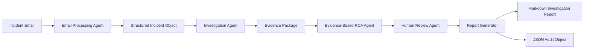
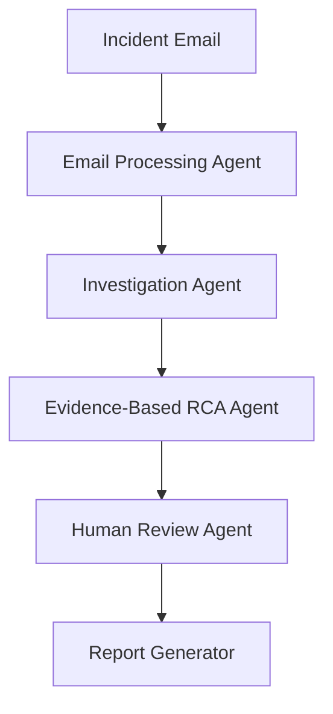
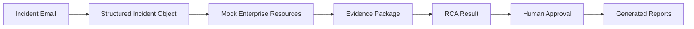
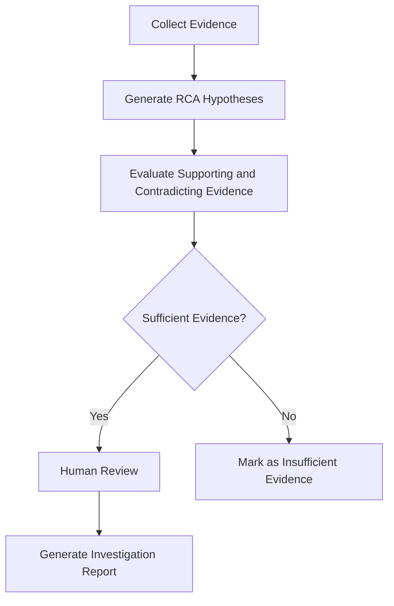

# FutureCATLeaf Architecture

**FutureCATLeaf – AI-Assisted Functional Investigation System**

**Tagline:**
*Evidence First. Reason Second. Human Always.*

---

# Executive Overview

FutureCATLeaf is a multi-agent AI system built using the **Google Agent Development Kit (ADK)** and **Gemini**. It assists enterprise functional support teams in investigating business application incidents by collecting evidence, reasoning about possible root causes, involving a human reviewer, and generating a structured Functional Investigation Report.

Unlike traditional AI assistants that immediately suggest solutions, FutureCATLeaf follows an **evidence-first investigation approach**. Each AI agent performs a single responsibility and contributes to a shared Structured Incident Object. This design improves explainability, traceability, and maintainability while ensuring that final conclusions remain under human control.

The project is implemented using mock enterprise resources and does not connect to production systems.

---

# Architecture Objectives

The architecture is designed with the following objectives:

* Evidence before conclusions
* Separation of agent responsibilities
* Explainable AI reasoning
* Human-in-the-loop approval
* Structured data exchange
* Responsible AI practices
* Auditability
* No production impact

---

# High-Level Workflow



---

# Multi-Agent Architecture

FutureCATLeaf separates the investigation into specialized AI agents. Each agent performs one well-defined responsibility before passing the Structured Incident Object to the next stage.

---

## 1. Email Processing Agent

### Responsibilities

* Read incoming incident email
* Extract business information
* Convert unstructured text into structured data
* Create the Structured Incident Object

### Output

* Incident ID
* Incident summary
* Application
* Reported issue
* Business context
* Initial metadata

---

## 2. Investigation Agent

### Responsibilities

Searches local mock enterprise resources, including:

* Application logs
* Deployment history
* Master data
* Knowledge documents
* Reference documents

Evidence collected from these resources is attached to the Structured Incident Object.

### Output

Evidence Package containing:

* Evidence description
* Source
* Relevance
* Confidence

---

## 3. Evidence-Based Root Cause Reasoning Agent

This agent performs reasoning using only the collected evidence.

Instead of immediately producing a conclusion, it evaluates multiple hypotheses and records:

* Supporting evidence
* Contradicting evidence
* Missing evidence
* Confidence level

If the available evidence is insufficient, the system explicitly reports that no reliable conclusion can be made.

### Output

* Most probable root cause
* Validation steps
* Workaround
* Corrective action
* Preventive action
* Insufficient evidence notification (when applicable)

---

## 4. Human Review Agent

AI recommendations are not considered final until reviewed by a human.

The reviewer:

* Reviews the investigation summary
* Enters reviewer name
* Approves or rejects the investigation
* Adds review comments

The approval decision becomes part of the investigation audit trail.

---

## 5. Functional Investigation Report Generator

The final agent generates two outputs.

### Markdown Report

A human-readable Functional Investigation Report suitable for sharing and documentation.

### JSON Audit Object

A structured investigation record containing:

* Incident details
* Evidence
* Root cause analysis
* Human approval
* Audit information

---

# Agent Interaction



---

# Structured Incident Object

The Structured Incident Object acts as the common contract shared by every agent.

Typical sections include:

* Incident Information
* Business Context
* Evidence
* Root Cause Analysis
* Human Review
* Recommendations
* Audit Metadata

Using a common structure allows every agent to operate independently while contributing to the same investigation.

---

# Data Flow



---

# Resource Structure

FutureCATLeaf currently operates entirely on local mock enterprise resources.

Example directory structure:

```text
resources/
├── logs/
├── deployments/
├── knowledge/
├── master_data/
└── reference_docs/
```

These resources simulate enterprise systems while ensuring that no production data is accessed.

---

# Responsible AI Workflow



---

# Security and Responsible AI

FutureCATLeaf follows responsible AI principles throughout the investigation process.

| Principle                | Implementation                                         |
| ------------------------ | ------------------------------------------------------ |
| Evidence-Based Reasoning | Conclusions are supported by collected evidence        |
| Explainability           | Evidence and reasoning are documented in the report    |
| Human Oversight          | Human approval is required before finalization         |
| Auditability             | JSON audit object captures investigation history       |
| Mock Data Only           | Uses local sample data only                            |
| No Automated Actions     | Performs analysis without modifying enterprise systems |
| Transparency             | Reports when evidence is insufficient                  |

---

# Current Scope

Current capabilities include:

* Incident email processing
* Evidence collection
* Evidence-based reasoning
* Human review workflow
* Markdown report generation
* JSON audit generation

---

# Future Roadmap

FutureCATLeaf is designed as a foundation that can evolve into a production-ready enterprise investigation platform. Planned enhancements include:

* **ServiceNow integration** to automatically retrieve and update incident tickets.
* **Oracle Database integration** for direct access to enterprise application data and master records.
* **Gmail incident ingestion** to process incident emails directly from a mailbox.
* **Semantic search over Functional Reference Guides** to improve evidence retrieval using AI-powered document search.
* **Learning from approved investigations** to improve future recommendations while maintaining human oversight.
* **Interactive web dashboard** for monitoring investigations and reviewing generated reports.
* **Analytics and incident trend reporting** to identify recurring issues, common root causes, and operational insights.
* **Multi-user workflow** to support collaboration between functional analysts, reviewers, and support teams.


---

# Design Philosophy

FutureCATLeaf demonstrates how AI can augment enterprise functional support by assisting analysts with structured investigations rather than replacing human decision-making.

The system prioritizes evidence collection, transparent reasoning, and human oversight to produce reliable and explainable Functional Investigation Reports.

> **Evidence First. Reason Second. Human Always.**
