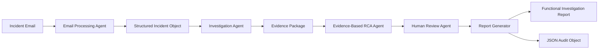
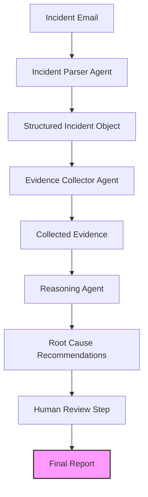

# FutureCATLeaf – AI-Assisted Functional Investigation System

### Evidence-First Multi-Agent Investigation for Enterprise Incident Resolution

**Category:** Agents for Business

**Developed by:** Sudhakar C V

---

FutureCATLeaf is a multi-agent AI system built using the Google Agent Development Kit (ADK) and Gemini to assist enterprise functional support teams in investigating business application incidents. By combining specialized AI agents with evidence-based reasoning and human review, the system transforms unstructured incident reports into transparent, auditable, and structured Functional Investigation Reports.

 **Evidence First. Reason Second. Human Always.**

# Problem Statement

Enterprise business applications play a critical role in day-to-day operations. When incidents occur, functional support teams are responsible for investigating reported issues, identifying the root cause, and recommending corrective actions.

A typical investigation begins with an incident reported through an email or a ticketing system. The functional consultant must then gather information from multiple enterprise resources, such as application logs, deployment history, master data, configuration documents, and knowledge articles. This process is often manual, time-consuming, and highly dependent on the experience of the individual investigator.

Several challenges commonly arise during this process:

- Incident information is often unstructured and incomplete.
- Relevant evidence is distributed across multiple sources.
- Investigations may follow different approaches depending on the investigator.
- Root cause conclusions are not always supported by documented evidence.
- Investigation reports are manually prepared, reducing consistency and increasing effort.

While Large Language Models can assist in analyzing information, enterprise incident investigations require more than a single AI response. They require structured evidence collection, transparent reasoning, and human oversight to ensure that recommendations are trustworthy and suitable for business decision-making.

These challenges motivated the development of **FutureCATLeaf**, an AI-assisted functional investigation system designed to support enterprise functional consultants by combining specialized AI agents with an evidence-first investigation approach.

# Why AI Agents?

Enterprise incident investigations involve multiple activities that require different types of reasoning. A single AI prompt can generate a response, but it cannot easily separate responsibilities such as understanding the incident, collecting evidence, evaluating competing hypotheses, incorporating human review, and producing structured reports.

FutureCATLeaf addresses this challenge by adopting a multi-agent architecture, where each agent is responsible for a specific stage of the investigation process.

The specialized agents collaborate through a common Structured Incident Object, allowing information gathered by one agent to be used by subsequent agents while maintaining a clear separation of responsibilities.

This approach provides several advantages:

- **Modularity:** Each agent performs a single well-defined responsibility, making the solution easier to maintain and extend.
- **Explainability:** Root cause recommendations are supported by collected evidence rather than generated directly from the incident description.
- **Traceability:** The investigation progresses through clearly defined stages, creating an auditable investigation process.
- **Human Oversight:** AI recommendations are reviewed by a human before the investigation is finalized.
- **Scalability:** Additional agents can be introduced in the future without redesigning the overall workflow.

By combining specialized agents with evidence-based reasoning and human review, FutureCATLeaf demonstrates how AI agents can assist enterprise functional consultants while maintaining transparency, accountability, and trust.

# Solution Overview

FutureCATLeaf is an AI-assisted functional investigation system that combines multiple specialized AI agents to support enterprise functional consultants throughout the incident investigation lifecycle.

The system begins by processing an incident email and converting the unstructured information into a Structured Incident Object. This object serves as the common data contract shared across all agents, ensuring that each stage of the investigation builds upon the outputs of the previous stage.

The Investigation Agent then searches mock enterprise resources, including application logs, deployment history, master data, and knowledge documents, to collect relevant evidence. The collected evidence is passed to the Evidence-Based Root Cause Reasoning Agent, which evaluates multiple hypotheses, identifies supporting and contradicting evidence, highlights unresolved gaps, and determines the most probable root cause. If the available evidence is insufficient, the system explicitly reports that a reliable conclusion cannot be reached.

Before the investigation is finalized, the Human Review Agent presents the findings to a reviewer for approval or revision. This ensures that AI-generated recommendations remain subject to human oversight and organizational accountability.

Finally, the Report Generator produces a Functional Investigation Report in Markdown format along with a JSON audit object that captures the investigation details, evidence, reasoning, review outcome, and recommendations.

The complete workflow is illustrated below.

This workflow demonstrates how multiple AI agents collaborate to transform an unstructured incident report into a structured, evidence-based, and human-reviewed functional investigation.

## High-Level Architecture

The architecture consists of four specialized agents that work together to:

1. **Understand the Incident:** The **Incident Parser Agent** analyzes the email and extracts key information such as the business area, reported issue, and affected entities.
2. **Gather Evidence:** The **Evidence Collector Agent** searches across multiple enterprise data sources—including Oracle Fusion Cloud, Jira, Confluence, and GitHub—to retrieve relevant documents and log entries.
3. **Perform Reasoning:** The **Reasoning Agent** evaluates the collected evidence, identifies potential root causes, and ranks them based on supporting evidence.
4. **Generate Report:** The **Report Generator Agent** compiles the evidence, reasoning, and recommendations into a formal Functional Investigation Report.

The system also includes a **Human Review Step** where the functional consultant reviews the AI-generated findings and approves the final report. This ensures that human expertise guides the investigation while AI handles the heavy lifting of evidence collection and analysis.

## Workflow

The workflow begins when an incident email is received. The Incident Parser Agent processes the email and populates a Structured Incident Object with key details. This object is then used by the Evidence Collector Agent to retrieve relevant information from across the enterprise landscape. The Reasoning Agent analyzes this evidence to identify potential root causes, which are then presented to the functional consultant for review. Once approved, the Report Generator Agent creates a formal report that documents the investigation process and findings.

This structured workflow ensures that every investigation follows a consistent evidence-based approach while maintaining human oversight throughout the process.

# Architecture

FutureCATLeaf follows a modular multi-agent architecture in which each agent is responsible for a specific stage of the investigation process. This separation of responsibilities improves maintainability, explainability, and extensibility while allowing each agent to focus on a well-defined task.

The agents communicate using a **Structured Incident Object**, which acts as a common data contract throughout the investigation. Each agent enriches the object with additional information before passing it to the next stage.

The architecture consists of the following agents:

### 1. Email Processing Agent

The Email Processing Agent reads an incident email and converts the unstructured text into a Structured Incident Object. It extracts key business information required for subsequent investigation.

**Responsibilities**

- Read incident email
- Extract business context
- Create the Structured Incident Object
- Normalize incident information

---

### 2. Investigation Agent

The Investigation Agent searches local mock enterprise resources to gather evidence relevant to the reported incident.

Evidence may be collected from:

- Application logs
- Deployment history
- Master data
- Functional knowledge documents
- Reference documentation

The collected evidence is added to the Structured Incident Object.

---

### 3. Evidence-Based Root Cause Reasoning Agent

This agent performs explainable reasoning using only the evidence collected during the investigation.

Rather than producing an immediate answer, the agent evaluates multiple hypotheses by identifying:

- Supporting evidence
- Contradicting evidence
- Missing information
- Confidence in each hypothesis

If the available evidence is insufficient, the agent explicitly reports that a reliable conclusion cannot be reached.

---

### 4. Human Review Agent

The Human Review Agent ensures that AI recommendations remain advisory rather than autonomous.

The reviewer:

- Reviews the investigation summary
- Approves or rejects the findings
- Provides review comments

The review outcome becomes part of the investigation audit trail.

---

### 5. Functional Investigation Report Generator

After approval, the Report Generator creates two outputs:

- A Markdown Functional Investigation Report suitable for documentation and sharing.
- A JSON audit object containing the investigation details, evidence, reasoning, review outcome, and recommendations.

These outputs provide both human-readable documentation and a structured audit record.

---

The modular architecture allows FutureCATLeaf to be extended with additional agents or enterprise integrations in the future without requiring significant changes to the existing workflow.

# Responsible AI

Responsible AI was a key design consideration throughout the development of FutureCATLeaf. The objective was not to automate enterprise decision-making, but to assist functional consultants by providing structured, evidence-based recommendations while ensuring that final decisions remain under human control.

The solution incorporates the following Responsible AI principles:

### Evidence Before Conclusions

Root cause recommendations are generated only after collecting relevant evidence from mock enterprise resources. The system avoids making unsupported conclusions directly from the incident description.

### Explainable Reasoning

The Evidence-Based Root Cause Reasoning Agent evaluates multiple hypotheses and documents:

- Supporting evidence
- Contradicting evidence
- Evidence gaps
- Most probable root cause

This allows reviewers to understand how the recommendation was derived.

### Human-in-the-Loop

AI-generated recommendations are advisory. Before an investigation is finalized, the Human Review Agent requires a reviewer to approve or reject the findings and provide comments. This ensures that business decisions remain the responsibility of human experts.

### Auditability

Every investigation produces a JSON audit object containing the investigation details, collected evidence, reasoning process, review outcome, and recommendations. This provides a structured record that can be retained for future reference.

### Mock Enterprise Data

FutureCATLeaf operates entirely on mock enterprise resources created for demonstration purposes. No production systems or confidential business information are accessed during execution.

### No Automated Enterprise Actions

The system performs analysis and generates recommendations only. It does not modify enterprise data, execute business transactions, or interact with production systems.

By combining evidence-based reasoning, explainability, human oversight, and auditability, FutureCATLeaf demonstrates how AI can responsibly assist enterprise functional support teams while maintaining transparency and trust.

# Technologies Used

FutureCATLeaf was developed using technologies introduced during the Google AI Agents: Intensive Vibe Coding course, combined with standard Python development tools.

| Technology | Purpose |
|------------|---------|
| **Google Agent Development Kit (ADK)** | Implements the multi-agent architecture and orchestrates the investigation workflow. |
| **Gemini 2.5 Flash** | Performs information extraction, evidence-based reasoning, and report generation. |
| **Python 3.11** | Core programming language used to implement the application and agent logic. |
| **Google Agents CLI** | Assisted with project scaffolding and development workflow during implementation. |
| **Antigravity IDE** | Used during iterative development and documentation refinement. |
| **Markdown** | Generates human-readable Functional Investigation Reports and project documentation. |
| **JSON** | Stores structured investigation and audit information for traceability. |
| **Git & GitHub** | Version control, collaboration, and public project hosting. |

The solution has been intentionally designed to be modular and extensible. While the current implementation uses local mock enterprise resources for demonstration purposes, the architecture can be extended to integrate with enterprise systems such as ticketing platforms, databases, and knowledge repositories in future versions.

# Demonstration

The project is demonstrated through a complete end-to-end investigation workflow using a mock enterprise incident.

The demonstration begins with an incident email describing a business application issue. The Email Processing Agent extracts the relevant information and converts it into a Structured Incident Object.

The Investigation Agent then searches mock enterprise resources, including deployment history, application logs, master data, and knowledge documents, to gather supporting evidence. The collected evidence is evaluated by the Evidence-Based Root Cause Reasoning Agent, which identifies multiple hypotheses, analyzes supporting and contradicting evidence, and determines the most probable root cause or reports insufficient evidence when appropriate.

Before the investigation is finalized, the Human Review Agent presents the findings for approval. The reviewer can approve or reject the recommendations and provide comments, ensuring that AI-generated conclusions remain subject to human oversight.

Finally, the Report Generator creates:

- A Functional Investigation Report in Markdown format.
- A JSON audit object containing the investigation details, evidence, reasoning, review outcome, and recommendations.

The demonstration highlights how multiple AI agents collaborate to transform an unstructured incident report into a structured, explainable, and human-reviewed investigation.

The complete source code, documentation, and setup instructions are available in the public GitHub repository, enabling reviewers to reproduce the project locally.

# Business Value

FutureCATLeaf is designed to assist enterprise functional support teams by making incident investigations more structured, transparent, and consistent. Rather than replacing functional consultants, the system supports them by automating repetitive investigation tasks while leaving business decisions under human control.

The solution provides value in several areas:

### Improved Investigation Efficiency

By automatically processing incident information and gathering relevant evidence from multiple sources, FutureCATLeaf reduces the manual effort required to begin an investigation.

### Consistent Investigation Process

The use of specialized AI agents ensures that every investigation follows the same structured workflow. This helps reduce variations in investigation quality and promotes a standardized approach to functional analysis.

### Evidence-Based Recommendations

Instead of generating unsupported conclusions, the system evaluates collected evidence before recommending the most probable root cause. This improves the transparency and credibility of AI-assisted investigations.

### Better Knowledge Capture

Each investigation produces a structured Markdown report and a JSON audit object. These outputs help preserve investigation knowledge, making it easier to review previous incidents and share knowledge across support teams.

### Human Accountability

The Human Review Agent ensures that AI recommendations remain advisory. Functional consultants review, approve, or reject findings before an investigation is finalized, maintaining business accountability and governance.

Overall, FutureCATLeaf demonstrates how AI agents can assist enterprise support teams by improving the efficiency, consistency, and quality of functional investigations while maintaining responsible AI practices.

# Lessons Learned

Developing FutureCATLeaf provided valuable insights into the design and implementation of AI agent systems for enterprise applications.

One of the key learnings was that enterprise incident investigations are best approached as a sequence of specialized tasks rather than a single AI interaction. Dividing the workflow into multiple agents resulted in a solution that is easier to understand, maintain, and extend.

Another important lesson was the value of evidence-based reasoning. Rather than asking an AI model to directly determine a root cause, collecting and evaluating supporting evidence before reaching a conclusion produces recommendations that are more transparent and easier for users to trust.

The project also reinforced the importance of keeping humans involved in business-critical decisions. While AI can assist in organizing information, identifying patterns, and generating recommendations, the final decision should remain with a functional consultant who understands the business context.

Finally, the project demonstrated the importance of designing AI solutions with future extensibility in mind. By using a modular multi-agent architecture and a Structured Incident Object, FutureCATLeaf can be extended with additional agents and enterprise integrations without requiring major architectural changes.

Overall, this project strengthened my understanding of multi-agent application design, responsible AI principles, and the practical application of AI agents to solve real enterprise business problems.

# Future Roadmap

FutureCATLeaf has been designed with a modular architecture that supports future enhancements and enterprise integrations. Potential future improvements include:

- **ServiceNow integration** to automatically retrieve and update incident tickets.
- **Oracle Database integration** for direct access to enterprise application data and master records.
- **Gmail incident ingestion** to process incident emails directly from a mailbox.
- **Semantic search over Functional Reference Guides** to improve evidence retrieval using AI-powered document search.
- **Learning from approved investigations** to improve future recommendations while maintaining human oversight.
- **Interactive web dashboard** for monitoring investigations and reviewing generated reports.
- **Analytics and incident trend reporting** to identify recurring issues, common root causes, and operational insights.
- **Multi-user workflow** to support collaboration between functional analysts, reviewers, and support teams.

These enhancements represent potential future directions and are outside the scope of the current capstone project.

# Conclusion

FutureCATLeaf demonstrates how a multi-agent AI system can assist enterprise functional support teams by transforming unstructured incident reports into structured, evidence-based investigations.

The project combines specialized AI agents, explainable reasoning, and human oversight to support functional consultants throughout the investigation lifecycle. Rather than replacing human expertise, FutureCATLeaf is designed to augment it by reducing manual effort, improving consistency, and providing transparent recommendations supported by evidence.

Developed using the Google Agent Development Kit (ADK) and Gemini, the project applies concepts from the Google AI Agents: Intensive Vibe Coding course to a practical enterprise use case. The modular architecture, structured investigation workflow, and Responsible AI principles provide a foundation that can be extended to support future enterprise integrations and additional business scenarios.

FutureCATLeaf reflects the belief that effective enterprise AI solutions should prioritize transparency, accountability, and human collaboration.